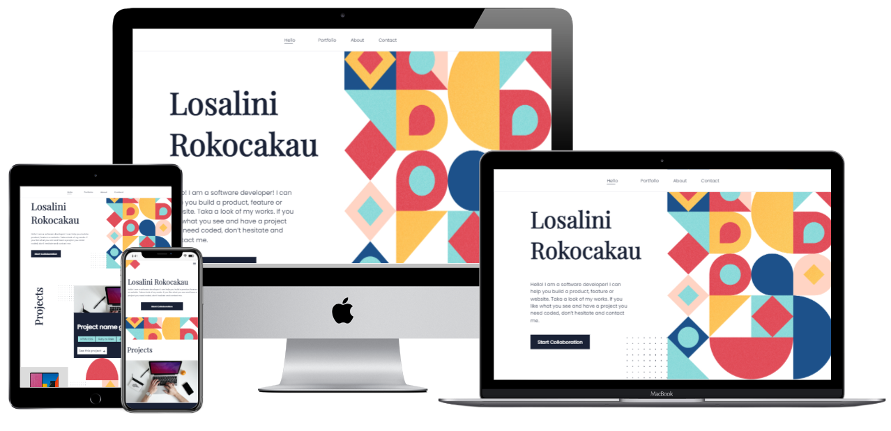

# My Portfolio

> This is my portfolio website. I've replicated a design template from Figma. It is a continuous project where each milestone requires a new feature in order to build the complete website.


## Built With

- HTML5
- CSS3
- JavaScript
- Git

## Live Demo

[Previous Live Demo Link]()

[GitHub Pages Link](https://chelmerrox.github.io/my-portfolio/)

## Preview



## Getting Started

To get a local copy up and running follow these simple example steps.

### Prerequisites

- HTML5 & CSS3 
- JavaScript
- VSCode (or any other text editor)
- Git
- GitHub
- Command line/Terminal

### Setup

From the command line, do the following steps below:

1. Clone the projects' repository into your machine.

```bash
# Clone this repository
$ git clone git@github.com:chelmerrox/my-portfolio.git

```
2. Change directory/Go into the repository with the command below.

```bash
$ cd my-portfolio

```

## Authors

👤 **Losalini Rokocakau**

- GitHub: [@chelmerrox](https://github.com/chelmerrox)
- Twitter: [@chelmerrox](https://twitter.com/chelmerrox)
- LinkedIn: [Losalini Rokocakau](https://linkedin.com/in/losalini-rokocakau)

👤 **Clifford Owusu**

- GitHub: [@sireclifford](https://github.com/sireclifford)


👤 **Edith Naisanga**

- GitHub: [@nedith](https://github.com/nedith)

👤 **Faranosh Amini**

- GitHub: [@FaranoshAmini](https://github.com/FaranoshAmini)

👤 **Maris Kelly Besong**

- GitHub: [@kelwilson](https://github.com/kelwilson)

## 🤝 Contributing

Contributions, issues, and feature requests are welcome!

Feel free to check the [issues page](https://github.com/chelmerrox/my-portfolio/issues).

## Show your support

Give a ⭐️ if you like this project!

## Acknowledgments

- Microverse
- Coding & Learning Partners: 
  1. Okolo Oshoke
  2. Amol Charpe 
  3. Clifford Owusu
  4. Edith Naisanga
  5. Faranosh Amini
  6. Maris Kelly Besong
- Morning Session Teams
- Stand-Up Teams
- Microverse TSEs
- Figma 

## 📝 License

This project is [MIT](./MIT.md) licensed.